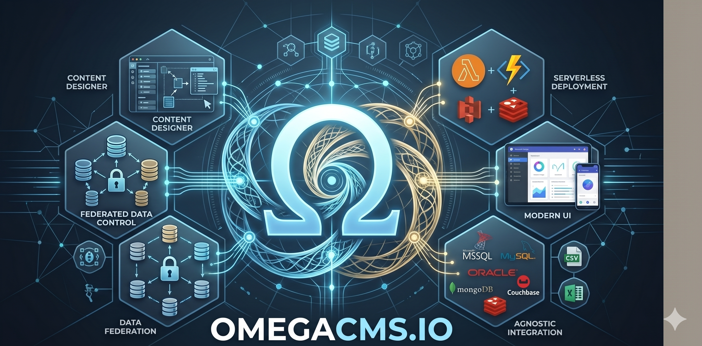

  

# MD.CMS.Administration.Core.AwsLambda.Container

**Container** image for the **administration** Lambda host.

## Project metadata

- **Target framework:** `net10.0`

## Responsibilities

- Implements the primary project role described above.
- Exposes contracts, runtime behavior, or host wiring consumed by sibling projects in `MD.CMS.Core.sln`.
- Uses repository-level configuration and environment conventions documented in the wiki.

## Cloud/runtime notes

- **AWS**: This project participates in AWS deployments (Lambda, container image, or shared AWS integration logic).
- **AWS project type** (`AWSProjectType`): `Lambda`.
- **Lambda runtime**: Validate handler/bootstrap configuration and environment variables before packaging and deploy.
- **Container packaging**: Keep image tag/versioning aligned with deployment scripts or CI release variables.

## Cloud setup deep dive

**Setup path**
- Configure container template parameters (`BasePluginsLayer`, `ProductLayer`, `WebAppPath`, startup entrypoint).
- Keep `StageName` and gateway names aligned with administration URL expectations.
- Ensure plugin and static admin assets are included in image/layer layout.

**Required elements**
- Container build/publish workflow integrated into release pipeline.
- Valid layer ARNs and stack parameters for VPC/network and trace settings.
- Consistent environment values for admin host URLs and plugin providers.

**Effects in the system**
- Moves administration hosting to containerized Lambda deployment with explicit filesystem/runtime shape.
- Faster iteration on bundled dependencies, but tighter coupling to image release cadence.
- Stage/path mismatches lead to inaccessible admin routes or broken static asset loading.

## Build

From the repository root:

    dotnet build .\MD.CMS.Administration.Core.AwsLambda.Container\MD.CMS.Administration.Core.AwsLambda.Container.csproj -c Debug

## Optional local run

If this project is an executable host, run:

    dotnet run --project .\MD.CMS.Administration.Core.AwsLambda.Container\MD.CMS.Administration.Core.AwsLambda.Container.csproj

Library projects should usually be consumed through a host project instead of running directly.

## Key files

- `MD.CMS.Administration.Core.AwsLambda.Container\MD.CMS.Administration.Core.AwsLambda.Container.csproj`
- `aws-lambda-tools-defaults.json` (AWS deployment defaults)

## Documentation

- [Solution layout](https://github.com/zlatko-lakisic/omegacms/wiki/Solution-Layout)
- [Build and run](https://github.com/zlatko-lakisic/omegacms/wiki/Build-and-Run)
- [AWS and serverless](https://github.com/zlatko-lakisic/omegacms/wiki/AWS-and-Serverless)
- [OmegaCMS solution wiki](https://github.com/zlatko-lakisic/omegacms/wiki)
- [Omega IT LLC](https://omega-it.solutions)
