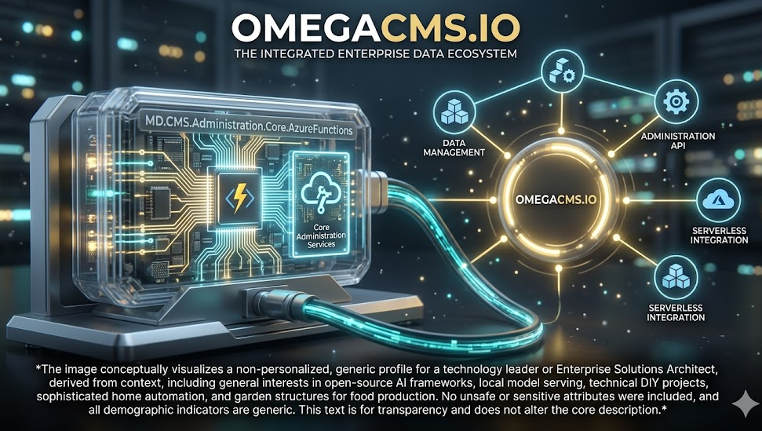

  

# MD.CMS.Administration.Core.AzureFunctions

Administration entry point for **Azure Functions** hosting.

## Project metadata

- **Target framework:** `net10.0`

## Responsibilities

- Implements the primary project role described above.
- Exposes contracts, runtime behavior, or host wiring consumed by sibling projects in `MD.CMS.Core.sln`.
- Uses repository-level configuration and environment conventions documented in the wiki.

## Cloud/runtime notes

- **Azure Functions**: Confirm trigger/binding config and app settings for function-hosted execution.

## Cloud setup deep dive

**Setup path**
- Configure startup and host behavior from `Program.cs` and `Startup.cs`.
- Align `appsettings.Development.json`/environment settings with Azure Functions app settings.
- Validate local launch profile before publishing to Azure Function App resources.

**Required elements**
- Azure subscription/resource group + Function App target.
- Function runtime-compatible settings and bindings.
- Environment values for downstream CMS/API dependencies and storage/providers.

**Effects in the system**
- Runs administration host flow inside Azure Functions hosting model.
- Function runtime constraints (cold start, binding config) influence admin startup/latency.
- Incorrect app settings can silently break dependency resolution at startup.

## Build

From the repository root:

    dotnet build .\MD.CMS.Administration.Core.AzureFunctions\MD.CMS.Administration.Core.AzureFunctions.csproj -c Debug

## Optional local run

If this project is an executable host, run:

    dotnet run --project .\MD.CMS.Administration.Core.AzureFunctions\MD.CMS.Administration.Core.AzureFunctions.csproj

Library projects should usually be consumed through a host project instead of running directly.

## Key files

- `MD.CMS.Administration.Core.AzureFunctions\MD.CMS.Administration.Core.AzureFunctions.csproj`

## Documentation

- [Solution layout](https://github.com/zlatko-lakisic/omegacms/wiki/Solution-Layout)
- [Build and run](https://github.com/zlatko-lakisic/omegacms/wiki/Build-and-Run)
- [AWS and serverless](https://github.com/zlatko-lakisic/omegacms/wiki/AWS-and-Serverless)
- [OmegaCMS solution wiki](https://github.com/zlatko-lakisic/omegacms/wiki)
- [Omega IT LLC](https://omega-it.solutions)
