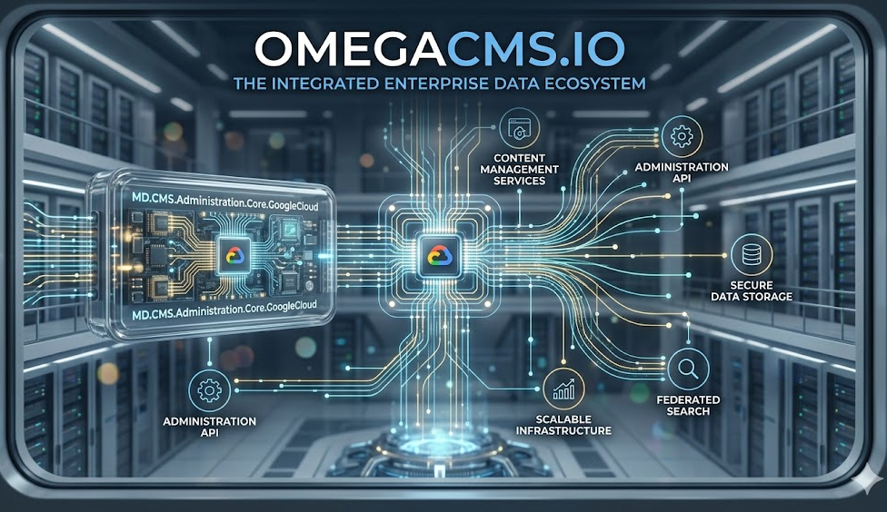

  

# MD.CMS.Administration.Core.GoogleCloud

Administration UI host for **Google Cloud**.

## Project metadata

- **Product** (`.csproj`): `OmegaCMS Google Cloud App Engine Administration`
- **Target framework:** `net10.0`

## Responsibilities

- Implements the primary project role described above.
- Exposes contracts, runtime behavior, or host wiring consumed by sibling projects in `MD.CMS.Core.sln`.
- Uses repository-level configuration and environment conventions documented in the wiki.

## Cloud/runtime notes

- **Google Cloud**: Align service configuration, credentials, and environment mapping with platform conventions.

## Cloud setup deep dive

**Setup path**
- Use Google deployment helpers (`google-deploy.bat`, `publish-project.bat`, `create-links.bat`) and `dispatch.yaml`/`app.yaml`.
- Ensure admin static files and ASP.NET host output are published to the expected GCP runtime path.
- Confirm URL routing in `dispatch.yaml` matches admin entry URLs.

**Required elements**
- GCP deploy permissions and configured target project/service.
- Valid app routing + service mapping (`app.yaml`, `dispatch.yaml`).
- Consistent admin host URL/environment settings matching the cloud domain.

**Effects in the system**
- Hosts administration UI on GCP-managed runtime and routing layer.
- Routing or publish-script misconfiguration typically surfaces as 404/static asset issues.
- Directly affects operator access path and admin panel responsiveness.

## Build

From the repository root:

    dotnet build .\MD.CMS.Administration.Core.GoogleCloud\MD.CMS.Administration.Core.GoogleCloud.csproj -c Debug

## Optional local run

If this project is an executable host, run:

    dotnet run --project .\MD.CMS.Administration.Core.GoogleCloud\MD.CMS.Administration.Core.GoogleCloud.csproj

Library projects should usually be consumed through a host project instead of running directly.

## Key files

- `MD.CMS.Administration.Core.GoogleCloud\MD.CMS.Administration.Core.GoogleCloud.csproj`

## Documentation

- [Solution layout](https://github.com/zlatko-lakisic/omegacms/wiki/Solution-Layout)
- [Build and run](https://github.com/zlatko-lakisic/omegacms/wiki/Build-and-Run)
- [AWS and serverless](https://github.com/zlatko-lakisic/omegacms/wiki/AWS-and-Serverless)
- [OmegaCMS solution wiki](https://github.com/zlatko-lakisic/omegacms/wiki)
- [Omega IT LLC](https://omega-it.solutions)
