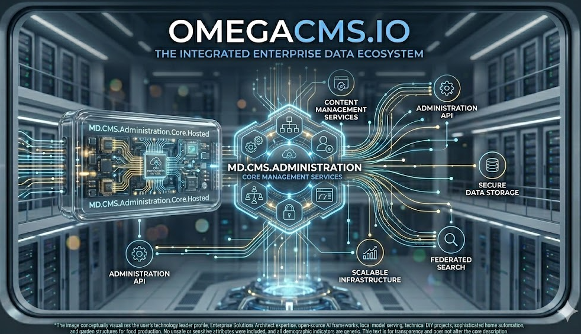

<p align="center">
  
</p>

# MD.CMS.Administration

**Operator administration UI** for OmegaCMS: an **AngularJS** (1.x) and **Angular Material** single-page app, built with **Yarn**, **Gulp**, and related tooling. The ASP.NET Core **host** that serves the compiled static assets lives in the subfolder **`MD.CMS.Administration.Core`**; serverless and alternate hosts are separate projects at the solution root (for example **`MD.CMS.Administration.Core.Hosted`**, **`MD.CMS.Administration.Core.AwsLambda`**).

## What lives here

| Area | Role |
|------|------|
| **`MD.CMS.Administration.Core/`** | .NET host project and build output for the admin app. See that folder’s **README** for `dotnet build` and **Product** metadata. |
| **`MD.CMS.Administration.Core.Web/`** | Client scripts, views, and static web content consumed by the host. |
| **`gulpfile.js`**, **`gulp/`** | Asset pipeline: build, inject, styles, tests, local server. |
| **`package.json`** | **Yarn** scripts (postinstall copies plugins, optional JSDoc/TypeDoc steps, etc.). |
| **`public-repo/omega-cms-businesslogic/`** | **Git submodule** — published business-logic package for the admin and integrators. Required for a full admin build; initialize with **`git submodule update --init --recursive`**. |
| **`karma.conf.js`**, **`protractor.conf.js`** | Unit and e2e test configuration (see solution conventions). |
| **Doc generators** (`jsdoc`, `typedoc`, `docfx` themes) | API and reference documentation for the client layer. |

## Client dependencies and Gulp

From the **repository root**:

```bash
cd MD.CMS.Administration
yarn install
```

Use the **`package.json`** scripts and root batch helpers (for example **`gulp-inject.bat`**, **`gulp-generateHtmlDocumentation.bat`**) as needed. Full front-end workflow: **[Build and run](https://github.com/zlatko-lakisic/omegacms/wiki/Build-and-Run#administration-front-end-yarn--gulp)** and **[Administration UI](https://github.com/zlatko-lakisic/omegacms/wiki/Administration-UI)** on the wiki.

## Run the hosted admin (development)

The typical hosted project is **`MD.CMS.Administration/MD.CMS.Administration.Core/MD.CMS.Administration.Core.csproj`**. From the repository root:

```bash
dotnet run --project MD.CMS.Administration/MD.CMS.Administration.Core/MD.CMS.Administration.Core.csproj
```

Match ports and URLs to **`OMEGA_ADMIN_HOST_URL`** and the guidance in **[Configuration](https://github.com/zlatko-lakisic/omegacms/wiki/Configuration)** on the wiki.

## Documentation

- [Administration UI](https://github.com/zlatko-lakisic/omegacms/wiki/Administration-UI)  
- [Build and run](https://github.com/zlatko-lakisic/omegacms/wiki/Build-and-Run) (Yarn, Gulp, submodules)  
- [Solution layout](https://github.com/zlatko-lakisic/omegacms/wiki/Solution-Layout)  
- [OmegaCMS solution wiki](https://github.com/zlatko-lakisic/omegacms/wiki)  
- [Omega IT LLC](https://omega-it.solutions)
