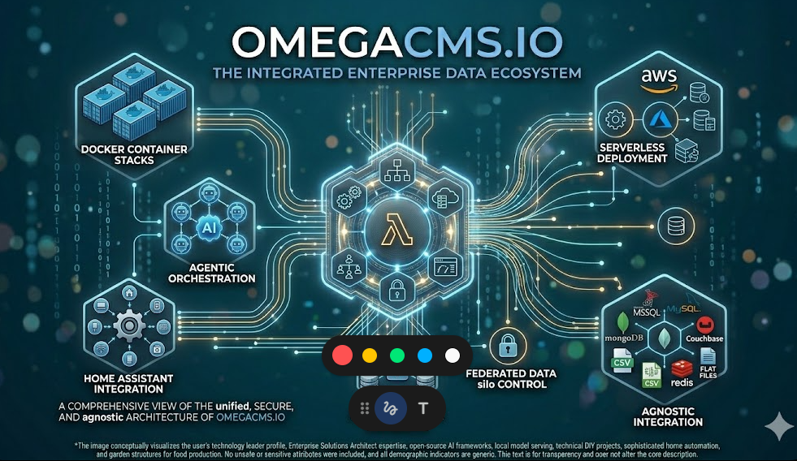

  

# MD.CMS.AwsLambda.CloudFormation.Core

AWS **CloudFormation** / **SAM** template and PowerShell helpers for deploying OmegaCMS to **AWS** (Lambda, API Gateway, CloudFront, and related resources). This folder is the **CloudFormation** project for ad-hoc and test stacks — not a .NET library you `dotnet run` like the Web API.

## Contents

| Item | Purpose |
|------|--------|
| **`cloudformation.template`** | Serverless application template (OmegaCMS stack parameters, Lambda, networking, etc.). |
| **`Powershell/Create.ps1`**, **`Update.ps1`**, **`Delete.ps1`** | Stack lifecycle scripts (invoked by TestRun wrappers or your own automation). |
| **`TestRun-Create.ps1`**, **`TestRun-Update.ps1`**, **`TestRun-Delete.ps1`** | Load **`TestRun.env`** and call the scripts above for a **one-off test** deploy. |
| **`TestRun.env.example`** | Copy to **`TestRun.env`** and fill in account-specific values (never commit secrets). |
| **`Powershell/Import-TestRunEnv.ps1`** | Loads environment variables from `TestRun.env`. |
| **`MD.CMS.AwsLambda.CloudFormation.Core.cfproj`** | Visual Studio / MSBuild project that includes the template and scripts. |

## Quick start (test stack)

1. Copy **`TestRun.env.example`** to **`TestRun.env`** in this directory.  
2. Set the variables documented in the example (stack name, domain, VPC, ACM cert, MySQL, SMTP, container/CMS versions, AWS keys, etc.).  
3. From this directory, run **`TestRun-Create.ps1`** (or **`TestRun-Update.ps1`** / **`TestRun-Delete.ps1`**) in PowerShell.

Details, parameter notes, and safety tips: **[CloudFormation test deploy](https://github.com/zlatko-lakisic/omegacms/wiki/CloudFormation-Test-Deploy)** on the solution wiki.

## Documentation

- [CloudFormation test deploy](https://github.com/zlatko-lakisic/omegacms/wiki/CloudFormation-Test-Deploy)  
- [AWS and serverless](https://github.com/zlatko-lakisic/omegacms/wiki/AWS-and-Serverless)  
- [OmegaCMS solution wiki](https://github.com/zlatko-lakisic/omegacms/wiki)  
- [Omega IT LLC](https://omega-it.solutions)
