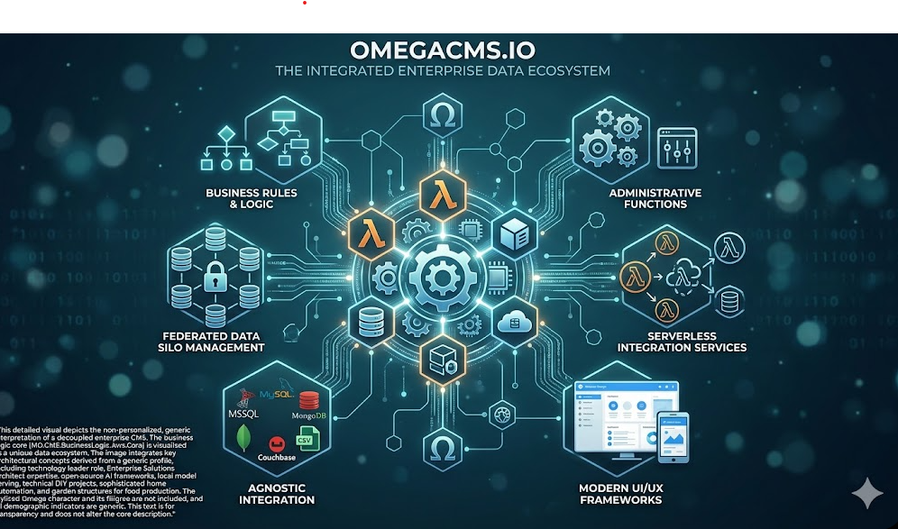

  

# MD.CMS.BusinessLogic.Aws.Core

AWS-specific business logic shared by Lambda and related API hosts.

## Project metadata

- **Target framework:** `net10.0`

## Responsibilities

- Implements the primary project role described above.
- Exposes contracts, runtime behavior, or host wiring consumed by sibling projects in `MD.CMS.Core.sln`.
- Uses repository-level configuration and environment conventions documented in the wiki.

## Cloud/runtime notes

- **AWS**: This project participates in AWS deployments (Lambda, container image, or shared AWS integration logic).

## Cloud setup deep dive

**Setup path**
- Reference this library from AWS host projects (Lambda/API/container) rather than deploying it alone.
- Keep AWS-specific adapters/config abstractions aligned with host-level runtime values.
- Validate package version compatibility with consuming Lambda host projects.

**Required elements**
- Consuming AWS host projects that provide concrete environment and deployment settings.
- Shared contracts for file-provider/plugin and data-access behavior.

**Effects in the system**
- Centralizes AWS-targeted business logic used across multiple services.
- Changes can affect API/admin behavior simultaneously in AWS-hosted runtimes.

## Build

From the repository root:

    dotnet build .\MD.CMS.BusinessLogic.Aws.Core\MD.CMS.BusinessLogic.Aws.Core.csproj -c Debug

## Optional local run

If this project is an executable host, run:

    dotnet run --project .\MD.CMS.BusinessLogic.Aws.Core\MD.CMS.BusinessLogic.Aws.Core.csproj

Library projects should usually be consumed through a host project instead of running directly.

## Key files

- `MD.CMS.BusinessLogic.Aws.Core\MD.CMS.BusinessLogic.Aws.Core.csproj`

## Documentation

- [Solution layout](https://github.com/zlatko-lakisic/omegacms/wiki/Solution-Layout)
- [Build and run](https://github.com/zlatko-lakisic/omegacms/wiki/Build-and-Run)
- [AWS and serverless](https://github.com/zlatko-lakisic/omegacms/wiki/AWS-and-Serverless)
- [OmegaCMS solution wiki](https://github.com/zlatko-lakisic/omegacms/wiki)
- [Omega IT LLC](https://omega-it.solutions)
