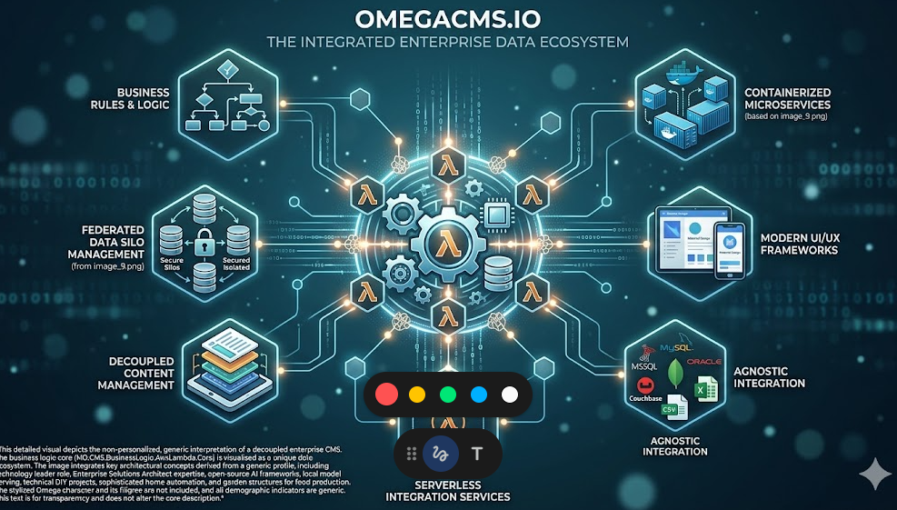

  

# MD.CMS.BusinessLogic.AwsLambda.Core

Business logic for the **AWS Lambda** packaging of the API and admin stack.

## Project metadata

- **Product** (`.csproj`): `OmegaCMS Aws Lambda Container Business Logic`
- **Packable:** yes (can produce a NuGet package when packed).
- **Target framework:** `net10.0`

## Responsibilities

- Implements the primary project role described above.
- Exposes contracts, runtime behavior, or host wiring consumed by sibling projects in `MD.CMS.Core.sln`.
- Uses repository-level configuration and environment conventions documented in the wiki.

## Cloud/runtime notes

- **AWS**: This project participates in AWS deployments (Lambda, container image, or shared AWS integration logic).
- **Lambda runtime**: Validate handler/bootstrap configuration and environment variables before packaging and deploy.

## Build

From the repository root:

    dotnet build .\MD.CMS.BusinessLogic.AwsLambda.Core\MD.CMS.BusinessLogic.AwsLambda.Core.csproj -c Debug

## Optional local run

If this project is an executable host, run:

    dotnet run --project .\MD.CMS.BusinessLogic.AwsLambda.Core\MD.CMS.BusinessLogic.AwsLambda.Core.csproj

Library projects should usually be consumed through a host project instead of running directly.

## Key files

- `MD.CMS.BusinessLogic.AwsLambda.Core\MD.CMS.BusinessLogic.AwsLambda.Core.csproj`

## Documentation

- [Solution layout](https://github.com/zlatko-lakisic/omegacms/wiki/Solution-Layout)
- [Build and run](https://github.com/zlatko-lakisic/omegacms/wiki/Build-and-Run)
- [AWS and serverless](https://github.com/zlatko-lakisic/omegacms/wiki/AWS-and-Serverless)
- [OmegaCMS solution wiki](https://github.com/zlatko-lakisic/omegacms/wiki)
- [Omega IT LLC](https://omega-it.solutions)
