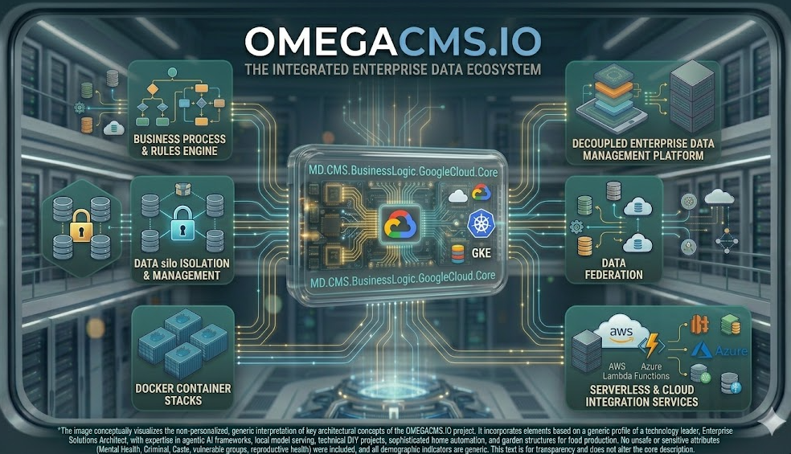

  

# MD.CMS.BusinessLogic.GoogleCloud.Core

Google Cloud–related business services (for example storage integration).

## Project metadata

- **Target framework:** `net10.0`

## Responsibilities

- Implements the primary project role described above.
- Exposes contracts, runtime behavior, or host wiring consumed by sibling projects in `MD.CMS.Core.sln`.
- Uses repository-level configuration and environment conventions documented in the wiki.

## Cloud/runtime notes

- **Google Cloud**: Align service configuration, credentials, and environment mapping with platform conventions.

## Cloud setup deep dive

**Setup path**
- Consume from GoogleCloud host projects and keep cloud-specific integrations scoped here.
- Validate environment/config assumptions against GCP deployment profiles.
- Verify compatibility with data-access and helper libraries used by GCP hosts.

**Required elements**
- GoogleCloud host projects that reference this core package.
- Stable configuration contract for credentials/endpoints used by GCP runtime.

**Effects in the system**
- Encapsulates cloud-provider-specific business rules for GCP deployments.
- Updates here propagate to both API/admin cloud-host behavior on Google Cloud.

## Build

From the repository root:

    dotnet build .\MD.CMS.BusinessLogic.GoogleCloud.Core\MD.CMS.BusinessLogic.GoogleCloud.Core.csproj -c Debug

## Optional local run

If this project is an executable host, run:

    dotnet run --project .\MD.CMS.BusinessLogic.GoogleCloud.Core\MD.CMS.BusinessLogic.GoogleCloud.Core.csproj

Library projects should usually be consumed through a host project instead of running directly.

## Key files

- `MD.CMS.BusinessLogic.GoogleCloud.Core\MD.CMS.BusinessLogic.GoogleCloud.Core.csproj`

## Documentation

- [Solution layout](https://github.com/zlatko-lakisic/omegacms/wiki/Solution-Layout)
- [Build and run](https://github.com/zlatko-lakisic/omegacms/wiki/Build-and-Run)
- [AWS and serverless](https://github.com/zlatko-lakisic/omegacms/wiki/AWS-and-Serverless)
- [OmegaCMS solution wiki](https://github.com/zlatko-lakisic/omegacms/wiki)
- [Omega IT LLC](https://omega-it.solutions)
