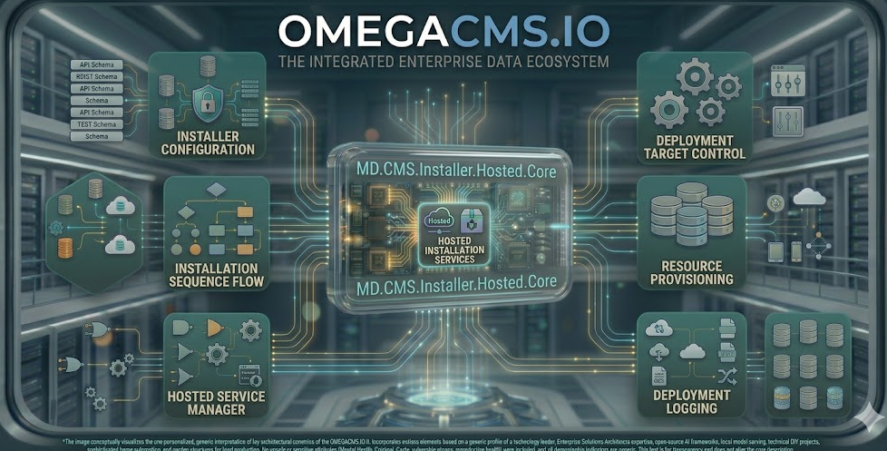

  

# MD.CMS.Installer.Hosted.Core

Hosted **installer** flow for deploying Administration, Web API, and related components to a server.

## Project metadata

- **Product** (`.csproj`): `OmegaCMS Hosted Installer`
- **Target framework:** `net10.0`

## Responsibilities

- Implements the primary project role described above.
- Exposes contracts, runtime behavior, or host wiring consumed by sibling projects in `MD.CMS.Core.sln`.
- Uses repository-level configuration and environment conventions documented in the wiki.

## Cloud/runtime notes

- **Hosted ASP.NET Core**: Run with local launch profiles (IIS Express or Kestrel) for day-to-day development.

## Build

From the repository root:

    dotnet build .\MD.CMS.Installer.Hosted.Core\MD.CMS.Installer.Hosted.Core.csproj -c Debug

## Optional local run

If this project is an executable host, run:

    dotnet run --project .\MD.CMS.Installer.Hosted.Core\MD.CMS.Installer.Hosted.Core.csproj

Library projects should usually be consumed through a host project instead of running directly.

## Key files

- `MD.CMS.Installer.Hosted.Core\MD.CMS.Installer.Hosted.Core.csproj`

## Documentation

- [Solution layout](https://github.com/zlatko-lakisic/omegacms/wiki/Solution-Layout)
- [Build and run](https://github.com/zlatko-lakisic/omegacms/wiki/Build-and-Run)
- [AWS and serverless](https://github.com/zlatko-lakisic/omegacms/wiki/AWS-and-Serverless)
- [OmegaCMS solution wiki](https://github.com/zlatko-lakisic/omegacms/wiki)
- [Omega IT LLC](https://omega-it.solutions)
