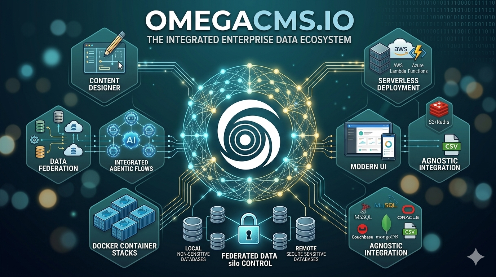

<p align="center">
  
</p>

# OmegaCMS

**OmegaCMS** is an enterprise content management (ECM) platform developed by [Omega IT LLC](https://omegacms.io) with a focus on *decoupling* how data is managed from how it is presented. It targets the “fragmented data” problem common in large organizations: you can govern and serve content across disparate sources without forcing a single monolithic data store or a one-shot migration.

This repository is the main **.NET** solution for OmegaCMS: business logic, Web API, administration hosts, pluggable data access, and deployment targets including traditional hosting, **AWS Lambda**, **Azure Functions**, and **Google Cloud**.

---

## Platform overview

### Architectural philosophy: content-first

OmegaCMS is designed as a *content nervous system* rather than only a page builder:

- **Database-agnostic** — The platform is not locked to a single SQL dialect. Implementations can run on Microsoft SQL Server, MySQL, Oracle, document stores (for example MongoDB, Couchbase), or integrate with other backends including flat files (for example Excel/CSV) through the data-access layer and plugins.
- **Decoupled / headless** — A first-class management UI is complemented by APIs and client libraries (C#, JavaScript, TypeScript) so the same content can power websites, mobile apps, devices, or internal tools.
- **Serverless-friendly** — Components are designed to run on **AWS Lambda** and **Azure Functions** to reduce idle infrastructure cost for bursty or globally distributed workloads.

### Feature highlights

1. **Content designer**  
   Model content types with a visual, field-oriented approach: text, dates, media, and relationships. Saved models drive generated editing experiences, validation, and API surface area for that type, including **parent/child and cross-type relationships** without hand-written SQL for every case.

2. **Folder-style organization and governance**  
   Folders support permissions and inheritance, similar in spirit to a file system. Rules can be attached (for example: “content created under *Marketing* inherits a legal-review workflow”).

3. **Taxonomy and metadata**  
   Tagging and categorization support enterprise search, navigation, and reporting scenarios.

4. **Data federation**  
   A distinguishing enterprise pattern: **query and present without always migrating** source-of-record data. Sensitive line-of-business or regulated data can remain in existing high-security systems while OmegaCMS holds or surfaces non-sensitive metadata and integration glue. This also helps **legacy systems** that lack modern APIs: OmegaCMS can act as a bridge and a modern interaction layer.

5. **Integration and performance**  
   The ecosystem includes connectors and integration points for search stacks such as **Elasticsearch**, **Solr**, **Lucene**, and **Microsoft FAST Search**; **Redis** for distributed caching; and **Amazon S3** (and analogous patterns) for scalable binary storage.

6. **Administration UX**  
   The administrative experience follows **Material Design** principles and is built to work across desktop, tablet, and phone for field and operations users.

### Developer ecosystem and samples

Omega publishes supporting material on GitHub to speed up implementation, including:

- **[omega-cms-businesslogic](https://github.com/Omega-CMS/omega-cms-businesslogic)** — client-side business logic library (this solution references it as a **Git submodule** under `MD.CMS.Administration/public-repo/omega-cms-businesslogic`).

Additional open-source or sample assets (for example **omega-gridstack.js** for interactive grid layouts, and language-specific **C# / TypeScript / JavaScript** samples for authentication and CRUD) are published under the [Omega-CMS](https://github.com/Omega-CMS) organization where applicable.

### Where OmegaCMS fits

- **Startups and product teams** — Use as a structured **backend-for-content** to avoid building auth, storage, and data modeling from scratch for every product.
- **Healthcare** — Federation helps keep **regulated data in place** (for example aligned with HIPAA-style separation of duties) while still centralizing what can be centralized.
- **Finance** — Business rules, workflows, and **auditability** for reporting and compliance-oriented processes.
- **AI and agentic systems** — A stable **source of truth** and API layer can feed agents and automation **without** necessarily copying sensitive source data out of secure environments.

---

## What’s in this solution

| Area | Description |
|------|-------------|
| `MD.CMS.BusinessLogic.*` | Core business rules, services, and Web API integration. |
| `MD.CMS.WebApi.*` | HTTP API surface, including **Hosted**, **AwsLambda**, and **GoogleCloud** variants. |
| `MD.CMS.WebApi.Sockets.*` | Real-time / socket-related API pieces where included. |
| `MD.CMS.Administration.*` | Administration UI hosts (for example **Core**, **AwsLambda**, **AzureFunctions**, **GoogleCloud**). |
| `MD.Tools.BaseDataAccess.*` | Pluggable data access and provider model. |
| `MD.CMS.AwsLambda.CloudFormation.*` | Infrastructure and deployment scripts for AWS. |
| `MD.CMS.Template` | Client template / tooling (including a modern app subtree with its own `package.json`). |
| `Jenkins/`, `Jenkinsfile*` | CI/CD pipelines and related automation. |
| `Tools/`, `DownloadTools/` | Build helpers, SSL tooling, and download scripts. |

The primary Visual Studio / `dotnet` entry point is **`MD.CMS.Core.sln`**.  
C# language version is managed via `Directory.Build.props` (see repository root).

---

## Prerequisites

- **.NET SDK** compatible with **.NET 10** (`net10.0` target frameworks in project files).
- **Node.js** and **Yarn** (or npm, per project) for `MD.CMS.Administration` front-end dependencies and Gulp-based workflows.
- **Git** with submodule support.
- For cloud targets: **AWS CLI / SAM**, **Azure Functions** tooling, or **Google Cloud** tooling as required by the projects you build.

---

## Clone and submodules

This solution depends on a public business-logic client submodule. Clone with submodules:

```bash
git clone --recurse-submodules <your-git-remote-url>
cd <repo-directory>
```

If you already cloned without submodules:

```bash
git submodule update --init --recursive
```

---

## Build the .NET solution

From the solution root:

```bash
dotnet restore MD.CMS.Core.sln
dotnet build MD.CMS.Core.sln -c Debug
```

Run individual host projects (for example the hosted Web API or administration app) from Visual Studio or with `dotnet run --project <path-to-csproj>`.

---

## Configuration and local URLs

- Copy **`.env.example`** to **`.env`** in the solution root and set values for your environment. Real `.env` files must not be committed.
- ASP.NET Core maps configuration keys to environment variables: nested sections use `__` (double underscore). See the comments in **`.env.example`** for the pattern (for example `Config__...` segments).
- Optional URL hints for local development (also documented in `.env.example`):

  - `OMEGA_ADMIN_HOST_URL` (example: `http://localhost:5050`)
  - `OMEGA_WEBAPI_HOST_URL` (example: `http://localhost:5051`)

Projects may also define ports in their **`Properties/launchSettings.json`**; align `.env` and app settings with the profile you use (IIS Express, Kestrel, etc.).

For **CloudFormation** ad-hoc test deploys, see `MD.CMS.AwsLambda.CloudFormation.Core\TestRun.env.example` and copy to `TestRun.env` in that folder (not covered by the root `.env`).

---

## Administration UI (Node / Yarn)

The administration stack under `MD.CMS.Administration` uses **Yarn** scripts and Gulp. After installing JavaScript dependencies (from `MD.CMS.Administration`):

```bash
cd MD.CMS.Administration
yarn install
```

Follow the project’s `package.json` and any internal docs for `gulp` and build steps. The public **omega-cms-businesslogic** submodule is consumed from `MD.CMS.Administration/public-repo/omega-cms-businesslogic`.

---

## Continuous integration

Root **`Jenkinsfile`** and the **`Jenkinsfile-*.jdp`** files orchestrate remote builds, deployments, and (optionally) Slack notifications. Environment variables for Jenkins agents are described in **`.env.example`** and `Jenkins/omega-pipeline.env.example` (when present). Adjust job names, tokens, and credentials in your **CI** system—never commit secrets.

---

## More information

- Product site: [https://omegacms.io](https://omegacms.io)  
- Public client library: [https://github.com/Omega-CMS/omega-cms-businesslogic](https://github.com/Omega-CMS/omega-cms-businesslogic)

For product positioning, feature depth, and vertical use cases, the overview above reflects OmegaCMS’s design goals; exact feature availability in your deployment depends on configuration, licensed modules, and your infrastructure choices.
